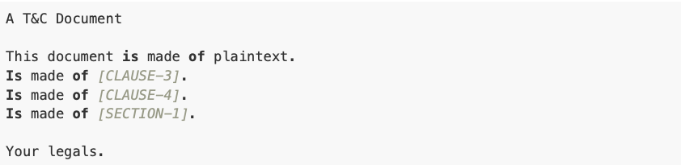
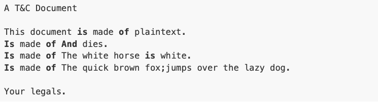

## About
The T&C generator is software which given:
- A template
- A dataset
Transforms the template into a Document expanding the template tags into their rappresentation using the dataset. Below you can find more details.
#### Template
Is a text made of: 
- Plaintext
- Tags

#### TAGS
The tags supported are:
Clauses: [CLAUSE-#{ID}]
Sections: A group of clauses, represented with [SECTION-#{ID}]

#### Example
Given the following template:



And the following dataset:
#### clauses:
```
 [
  { "id": 1, "text": 'The quick brown fox' },
  { "id": 2, "text": 'jumps over the lazy dog' },
  { "id": 3, "text": 'And dies' },
  { "id": 4, "text": 'The white horse is white' }
]
```
#### sections:
```
[
  { "id": 1, "clauses_ids": [1, 2] }
]
```

Creates the following T&C document:



## Code related design decisions
* Entities related to the problem domain are - TemplateGenerator, DocGenerator
* A DocGenerator has - template generator. They satisfy the **"has_a"** relationship hence I've made use this composition.
```
DocGenerator -------> Template Generator
```
* Have made use of `ERB` class to combine plain text with **Ruby** code for variable substitution, making them easy to write and maintain 
* Used dataset for different values of variales like (clause-3, clause-4, section-1 )
* With **Single Responsibility Principle** in mind the responsibility of each class is:
  * A TemplateGenerator class is used to generate template using dataset, formatted code variables to meet the requirement
  * DocGenerator class responsible is to generate a document for a given template after walking through ERB to transform ruby variables to its respective valies and combine it with plain text and finally save doc with .html extension

## Usage

 #### Dependencies
   * Ruby 2.6.3

 #### Setup
   * Run `bundle install` from a project's root directory to install related dependencies 

 #### Running the program
 One can run the program with below command from the project's root directory

 *Format:*
 `ruby lib/doc_generator.rb` 
   * Please go to your home path, then search for t_and_c_doc.html file
   * Double click the `t_and_c_doc.html` file, it opens up in a browser, output will be displayed in plain text where few words will be bold. 

## Running the tests
  * One can run the specs from the project's root directory with the command rspec
  
## Improvements
  * By using gems can extend this to support css properties and html tags in flexible way 

## Program Output
  * Below is output for sample input as described in About section, run again the command `ruby lib/doc_generator.rb`

  
